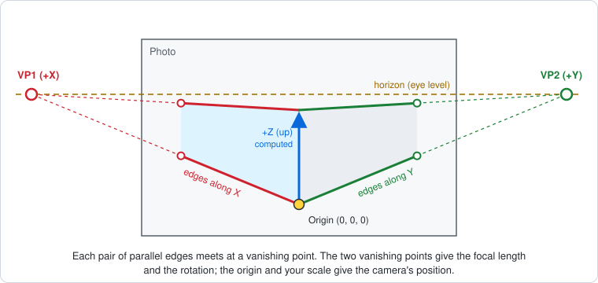
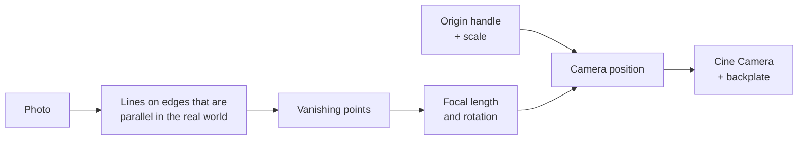

# Unreal Engine 5 editor tools: Camera Match, Light Mobility, Performance

Three editor tools for Unreal Engine 5. Each one is its own plugin, so install only the ones you need.

| Tool | What it does | Install | Full guide |
|---|---|---|---|
| [**Camera Match (from Photo)**](#camera-match-from-photo) | fSpy inside Unreal: drag lines onto edges in a backplate photo, and get a Cine Camera with the matching focal length, position and rotation, with the photo shown through it. | Compile once: double-click `Build-CameraMatch.bat` | [CAMERA_MATCH.md](CAMERA_MATCH.md) |
| [**Light Mobility Tool**](#light-mobility-tool) | Makes every light in every map Movable, safely, and can put the originals back. Works with Perforce. | Copy a folder, no compiling | [INSTALL.md](INSTALL.md) |
| [**Performance Improvements tab**](#performance-improvements-tab) | Scans the project and level, with per-setting toggles and an Auto Optimize that shows FPS before and after. Never touches textures. | Compile once: double-click `Build-PerformanceOptimizerUI.bat` | [PERFORMANCE.md](PERFORMANCE.md) |

**Contents:** [Download](#download) · [Camera Match](#camera-match-from-photo) ([install](#install-camera-match), [use](#use-camera-match), [how it works](#how-camera-match-works)) · [Light Mobility Tool](#light-mobility-tool) · [Performance Improvements tab](#performance-improvements-tab) · [Tests](#tests)

## Download

On this page, click **Code → Download ZIP** and unzip it, or `git clone` the repository. You get:

```
unreal_light_movable/
├── CameraMatch/                       Camera Match plugin (C++)
├── LightMobilityTool/                 Light Mobility Tool plugin (Python, no compiling)
├── PerformanceOptimizerUI/            Performance Improvements tab (C++)
├── Build-CameraMatch.bat              builds and installs Camera Match
├── Build-PerformanceOptimizerUI.bat   builds and installs the Performance tab
├── Build-EditorPlugin.ps1             the build script both .bat files run
├── CAMERA_MATCH.md                    Camera Match guide
├── INSTALL.md                         step-by-step install guide
├── PERFORMANCE.md                     Performance tab guide
└── tests/
```

---

## Camera Match (from Photo)



**Camera Match** works like [fSpy](https://fspy.io), but inside the Unreal editor. You load a photo (the backplate) and drag colored lines
onto edges in it that are parallel in the real world. The tool works out the camera that took the photo: its
**focal length, field of view, position and rotation**. One click creates a **Cine Camera** with those settings, and shows the photo
through that camera, so the 3D objects you place line up with the photo.

- **Two methods, like fSpy:** **2 vanishing points** works out the focal length. **1 vanishing point** uses the focal length you enter.
- **Live check:** while you drag, the solved ground grid, X/Y/Z axes and horizon are drawn on the photo.
- **Scale** from the camera's distance, its height above the ground, or a length you know in the photo.
- **Backplate:** the photo is shown only through that camera, exactly framed, with adjustable opacity.
- **Fine-tune later** with **Live update** and **Edit Selected Camera**.

### Install Camera Match

**You need:**
- Unreal Engine **5.1 or later** (5.3+ recommended), on Windows.
- **Visual Studio 2022** (the free Community edition is fine) with these workloads:
  - **Game development with C++**
  - **Desktop development with C++**
  - **.NET desktop development**

  Restart the PC after installing it. You only do this once.

The plugin is C++, so it has to be compiled once for your engine version. The build script does that for you:

1. [Download](#download) the repository and unzip it.
2. **Close Unreal.**
3. Double-click **`Build-CameraMatch.bat`**, or drag your `.uproject` onto it.
4. Pick your `.uproject` when asked. The script:
   - finds your engine and checks Visual Studio;
   - compiles the plugin with Unreal's own build tool (`RunUAT BuildPlugin`), which takes a few minutes;
   - copies the result to `YourProject/Plugins/CameraMatch/`.
5. Open your project. If Unreal asks to enable the plugin, click **Yes**.
6. Check that it loaded: the **Tools** menu should have **Camera Match (from Photo)...**. If it's missing, open **Edit → Plugins**,
   search for *Camera Match*, tick it and restart the editor.

The script never submits anything and never overwrites read-only (Perforce) files. If the build fails, it prints the error lines
and the path of the full log. Send those, with your engine version, to get the code fixed.

<details>
<summary><b>Install by hand</b> (C++ project, Blueprint-only project, Perforce)</summary>

- **C++ project** (it has a `Source/` folder): copy the `CameraMatch` folder to `YourProject/Plugins/CameraMatch/`,
  right-click your `.uproject` and choose **Generate Visual Studio project files**, then build the *Development Editor* target.
  You can also just open the `.uproject` and click **Yes** when Unreal offers to rebuild the missing modules.
- **Blueprint-only project:** build the plugin once on a machine with Visual Studio:
  ```bat
  "C:\Program Files\Epic Games\UE_5.4\Engine\Build\BatchFiles\RunUAT.bat" BuildPlugin ^
    -Plugin="C:\path\to\CameraMatch\CameraMatch.uplugin" ^
    -Package="C:\Temp\CameraMatch_Built" -TargetPlatforms=Win64
  ```
  Use your engine version in the path, then copy `C:\Temp\CameraMatch_Built` to `YourProject/Plugins/CameraMatch/`.
  It contains `Binaries/`, so people without Visual Studio can use it.
- **Perforce:** submit `Plugins/CameraMatch/`, with `Binaries/` (so artists don't have to compile) but without `Intermediate/`.
- After an **engine upgrade**, build it again.

</details>

### Use Camera Match

1. Open **Tools → Camera Match (from Photo)...**
2. Click **Load Image File...** and pick the photo (PNG, JPG, BMP, TGA, EXR or TIFF). Or select a texture in the Content Browser
   and click **Use Selected Texture**.
3. Leave the method on **2 vanishing points** and drag the handles on the photo:
   - the two **red VP1 lines** onto two edges that run in one direction, for example the bottom and top of a building's left wall;
   - the two **green VP2 lines** onto two edges at 90° to that, for example the bottom and top of the right wall;
   - the yellow **Origin** handle onto a point on the ground, for example the bottom of the corner. That point becomes (0, 0, 0).
4. Under **Axes**, keep **VP1 = +X** and **VP2 = +Y** to start with. Check the **ground grid** drawn on the photo: it should lie flat
   on the ground, with the blue Z axis pointing up. If it's upside down or mirrored, flip the sign of one axis (for example **+X → −X**).
5. Under **Scale**, choose **Camera height** and enter how high the camera was (about 160 cm for a hand-held photo).
   Or choose **Known length** and drag the reference handle to something you know the size of.
6. Click **Create Camera**, then **Pilot Camera**. The viewport now looks through a camera that matches the photo, with the photo
   shown at 50% over the scene so you can check the match. Press **G** to hide the editor icons. To stop piloting, click the eject
   button at the top left of the viewport.
7. **File → Save All** keeps the camera and the new assets in `/Game/CameraMatch`.

**On the photo:** drag a handle to move it (hold **Shift** for fine control; a magnifier shows the area under it).
The **mouse wheel** zooms, a **right or middle drag** pans, and **F** fits the photo.

| Control | What it does |
|---|---|
| **Create Camera** | Adds a Cine Camera Actor (in the outliner folder `CameraMatch`) with the solved location, rotation, filmback and focal length, plus the backplate. One undo step. |
| **Update Camera** | Applies the current lines, settings and backplate options to the linked camera. |
| **Live update** | When ticked, dragging lines moves the linked camera straight away (one undo step per drag). |
| **Pilot Camera** | Looks through the camera in the level viewport. |
| **Edit Selected Camera** | Select a camera made with the tool and click this: its photo, lines and settings come back. |
| **Backplate opacity** / **Photo only behind 3D objects** | 0.5 shows the scene and the photo together; 1 shows only the photo. Or show the photo only where nothing is rendered, so 3D objects sit in front of it. |

**Lines that give a good match**
- Use long edges, as **far apart** as you can: the bottom and top of a wall work better than two lines next to each other.
- Zoom in to place the line ends accurately.
- If only one direction converges (a road or corridor seen head on), switch to **1 vanishing point**: put the VP1 lines on that
  direction, turn the horizon line to follow the horizon, and enter the focal length from the photo's EXIF data.
- Wide-angle and phone photos bend straight lines. Undistort them first (for example with Lightroom or Photoshop *Lens Correction*),
  or use edges near the middle of the photo.

Every setting, the assets the tool creates and troubleshooting are in **[CAMERA_MATCH.md](CAMERA_MATCH.md)**.

### How Camera Match works



It uses the same method as fSpy, from *Guillou et al., "Using vanishing points for camera calibration and coarse 3D reconstruction
from a single image"* (2000):

1. **Parallel edges meet in a photo.** Edges that are parallel in the real world, like the top and bottom of a wall, aren't parallel
   in a photo: carried on, they meet at a **vanishing point**. The tool intersects each pair of lines to find it.
2. **Each vanishing point is a direction.** The line from the camera through a vanishing point is parallel to the edges that meet
   there. So VP1 gives the direction of the X edges as the camera sees them, and VP2 the direction of the Y edges.
3. **The focal length comes from the 90° between them.** X and Y are perpendicular, so those two directions must be at 90°.
   Only one focal length makes that true: with the vanishing points `V1` and `V2` measured from the centre of the photo,
   `f = sqrt(-(V1 · V2))`. With **1 vanishing point** you give the focal length instead, and the horizon line gives the second direction.
4. **The rotation comes from the directions.** The two directions, signed by the axes you picked, are where world X and Y point in the
   camera's view. The third axis is perpendicular to both, with the sign that makes a valid Unreal frame (left-handed, Z up).
   Together they're the camera's rotation, turned into Pitch, Yaw and Roll the same way Unreal's `FMatrix::Rotator()` does it.
5. **The position comes from the origin and the scale.** The origin handle tells the tool in which direction the world origin lies
   from the camera. A photo can't tell how far, so the scale option does: the camera's distance, its height, or a length you know.
6. **The Unreal camera.** The Cine Camera gets that location and rotation, a sensor (filmback) with the photo's aspect ratio, and
   the focal length that gives the same field of view. Its frame then matches the photo exactly.
7. **The backplate.** A post-process material on that camera draws the photo in screen space, so it always fills the camera's frame
   exactly. It's drawn after the tonemapper, so the photo keeps its original colors. Only that camera shows it: it doesn't cast shadows,
   light the scene or show up in reflections.

The math is in `CameraMatch/Source/CameraMatch/Private/CameraMatchSolver.cpp` and has no Unreal dependencies. Its tests make
synthetic photos from known Unreal cameras and check that the tool gets each camera back (see [Tests](#tests)).

**Limits:** the lens centre is taken to be the centre of the photo (no lens shift), there's no lens distortion correction,
the backplate colors assume a normal (non-HDR) project, and `.fspy` project files can't be opened.

---

## Light Mobility Tool

Makes every light in every map Movable, safely, and can put the original mobility back. It's a Python plugin, so there's nothing
to compile: see [Install](#install) below.

Adds these commands to the **Tools** menu:

- **Lights: Make Movable in Open Level (no save)**: changes every light in the open level and its loaded sublevels.
  It does no Perforce or revision checks and **saves nothing**. You review the result, then save (Unreal asks for checkout as usual)
  or press Ctrl+Z. Use this when maps are out of date or you want to decide about saving yourself.
- **Lights: Restore Open Level (no save)**
- **Lights: Make All Movable (All Maps)**
- **Lights: Restore Original Mobility (All Maps)**
- **Lights: Preview (no changes)**

Each command runs once and finishes. Nothing keeps running in the background, and nothing is remembered between runs or editor restarts.
Running a command again goes through every map again.

- **Make All Movable:** after you confirm, the tool opens **every map in the project** (everything under `/Game`) one at a time.
  In each map it sets every light to **Movable**, so none are Static or Stationary, then saves the map.
  This covers Point, Spot, Rect, Directional and Sky lights, and also light components inside Blueprint actors.
  - Each light's original mobility is saved as a component tag (`LightMobilityTool.Original=Static`, for example).
  - **World Partition** maps are handled too. The tool loads their actors in batches of 500, so unloaded cells aren't skipped.
  - A progress bar with a **Cancel** button shows while it runs. When it finishes, it reopens the map you started on.
  - **Sublevels are included wherever they're stored**, even outside `/Game`. The tool finds them from the maps that use them.
  - **Before it starts**, the tool warns you about maps it will have to skip (out of date or locked in Perforce), so you can Get Latest first.
  - **The report** lists every map with how many lights it has (Movable / Stationary / Static), each light it changed,
    the lights it could **not** change because their map was skipped, and anything else skipped with the reason.
  - Lights you add later aren't changed automatically. Run the command again.
- **Restore Original Mobility:** opens every map again, sets each light back to its original mobility, removes the tag and saves the map.
- **Unsaved work is protected.** Opening another map makes Unreal throw away unsaved changes without asking, so the tool asks you to save first.
  If anything is still unsaved after that, for example a light you just placed, **the run doesn't start** and nothing is changed.
- The tool doesn't change anything while Play-In-Editor is running.

### Production safety: nothing moves

The tool changes only one setting per light, **Mobility**, plus a tag that remembers the original value.
After every change it checks that nothing else changed:

1. **Before:** it records the position, rotation and scale of every actor in the level, plus every component of the affected actors and anything attached to them.
   It also records their attachments, the mobility of non-light components, and the light settings
   (intensity, color, temperature, attenuation, cone angles, source size, IES, light function, shadows, lighting channels and so on).
2. **After:** it compares everything against the recording, with tolerances of 0.001 cm, 0.001° and 0.00001 scale.
3. **If anything else changed**, for example a Blueprint construction script reacting to the change:
   - the change is undone and the positions are put back;
   - the tool retries the lights one at a time, so only the light that caused the problem is left alone;
   - the file that light lives in is **not saved**;
   - the problem is listed under ERRORS in the report.
4. **Lights with non-movable things attached**, such as a lamp-shade mesh under a spot light, are skipped and reported.
   Unreal could force those attached things to Movable as well. Editor helpers, like the arrow on a directional light and light icon sprites, are ignored.
   Lights driven by a sun/sky Blueprint (for example SunSky with its compass mesh) can be skipped for that reason, and the report names the attached part.
5. **Rotation check:** rotation is compared as an actual orientation, not as pitch/yaw/roll numbers, so a sun pointing straight down (−90° pitch) isn't mistaken for a rotated one.
6. **Saving:** only the files that contain lights the tool changed are saved. Anything else Unreal marks as modified when it opens a map is thrown away.

**What does change visually.** Moving a light from Static or Stationary to Movable changes how Unreal renders it:
baked lightmaps and shadow maps are no longer used, and shadows and GI become fully dynamic.
That's the purpose of the tool, but it can change the look:
- **Lumen / fully dynamic projects:** expect little or no difference.
- **Projects relying on baked lighting:** expect visible differences.

For automotive and pixel-streaming work, compare a few reference shots before and after,
using Preview first and then a test branch, before rolling it out.

### Works with or without source control

The tool checks whether the editor is connected to source control and picks a mode automatically:

| | **Source control mode** (Perforce connected) | **Local mode** (no source control, or not connected) |
|---|---|---|
| Saving | Checks out each file, then saves it | Saves straight to disk |
| Read-only files | Checked out first, or skipped if that fails | Skipped, never overwritten |
| Out-of-date / locked by others | Skipped | Not applicable |
| Submits | Never | Not applicable |

The confirm dialog tells you which mode it's about to use.
In local mode on a normal project, back up or commit your project first, because maps are saved directly.

Local mode is still safe on a Perforce project where you forgot to connect. Perforce keeps files read-only until
they're checked out, so the tool skips them instead of overwriting them, and the report tells you to connect.
To make Perforce mandatory, set `REQUIRE_SOURCE_CONTROL = True`.

### Perforce safety (source control mode)

- **Skipped maps:** maps that aren't at the latest revision, or are checked out by someone else, are skipped entirely and listed in the report.
- **Checkout first:** a light is changed only after its file has been checked out. That's the `.umap`, or the actor's own file in `__ExternalActors__` for World Partition. If the checkout fails, the light is left alone.
- **No forced saves:** files that can't be checked out are never saved, and read-only files are never overwritten.
- **No submits:** nothing is submitted. Changes go to your default changelist, so you can review and submit them in P4V.
- **Report:** every run, in either mode, writes a report to `Saved/Logs/LightMobilityTool_<date>.txt` listing every change and skip.
- **Preview:** **Tools → Lights: Preview (no changes)** shows what would change without touching any file.

### Install

See **[INSTALL.md](INSTALL.md)** for the full step-by-step guide, including adding the plugin to Perforce and a safe first run.

Short version:
1. Copy the `LightMobilityTool` folder to `YourProject/Plugins/LightMobilityTool/`.
2. Restart the editor and accept enabling the plugin.
3. On a Perforce project, connect to Perforce in the editor. On a normal project, back up first.
   Then run **Tools → Lights: Preview (no changes)**.
4. Then run **Tools → Lights: Make All Movable (All Maps)**.

### Use from Python or the console

In the Output Log, switch the input from `Cmd` to `Python`:

```python
import light_mobility_tool as lmt
lmt.run_make_movable()            # all maps: make lights Movable (asks first)
lmt.run_restore()                 # all maps: restore originals
lmt.preview_all_maps()            # all maps: report only
lmt.find_all_maps()               # list the maps it will touch
lmt.make_all_lights_movable()     # open level only (not saved for you)
```

From a Blueprint (an Editor Utility Widget button, for example), use the **Execute Python Command** node with
`import light_mobility_tool as lmt; lmt.run_make_movable()`.

### Settings

These are at the top of `Content/Python/light_mobility_tool.py`:

- `MAP_ROOTS = ["/Game"]`: the folders searched for maps. Add `"/YourPlugin"` to include maps inside plugins,
  or narrow it to something like `["/Game/Maps"]`.
- `WP_ACTOR_BATCH_SIZE = 500`: how many World Partition actors are loaded at once. Lower it if memory runs out.

### Pure-Blueprint alternative (no Python)

If you'd rather build it as an Editor Utility Blueprint:

1. Create a new **Editor Utility Widget**: *Content Browser → right-click → Editor Utilities → Editor Utility Widget*.
2. Add a **CheckBox** and bind **On Check State Changed (Is Checked)**.
3. In the graph, call **Get All Level Actors** (Editor Actor Subsystem) and loop over the results with a **For Each Loop**.
   - On each actor, call **Get Components By Class** with `LightComponentBase`, and loop over those components.
   - **If checked:** if the component's mobility isn't Movable, call **Component Tags → Add** with `Orig_Static` or `Orig_Stationary`, then call **Set Mobility (Movable)**.
   - **If unchecked:** if the component has `Orig_Static` or `Orig_Stationary` in its tags, call **Set Mobility** with that value and remove the tag.
4. Right-click the widget and choose **Run Editor Utility Widget**.

That only covers the open level. The Python plugin also goes through every map, handles World Partition and Perforce, and checks that nothing moves.

### Notes

- Movable lights skip baked lighting entirely, so they cost more at runtime. If your project uses Lumen,
  lighting is effectively dynamic already and this mostly removes the "lighting needs rebuild" workflow.
- Lights created by a Blueprint **Construction Script** get rebuilt when that script reruns, so they go back
  to whatever the script sets. To make them Movable for good, set Mobility inside the Blueprint itself.
- The tool saves maps automatically. If you use source control (Perforce or Git LFS locking), check out the maps first,
  or the saves will fail; any failures show up in the Output Log.
- On a large project, going through every map can take a while. Commit or back up first, and test on a copy before running it.

---

## Performance Improvements tab

A dockable tab, **Tools → Performance Improvements...**, that:

- **Scans** the project settings and the open level, and shows every optimization as a row with its visual impact,
  an On/Off toggle and a suggestion;
- runs **Auto Optimize**: it measures the FPS, turns on the safe settings, measures again and shows **before → after**;
- only changes the running editor session. **Save to Project** writes the settings to `Config/DefaultEngine.ini`
  (checked out in Perforce and backed up first), and **Revert All** turns them off again;
- **never touches textures**: texture settings are on a hard deny list.

**Install:** close Unreal, double-click **`Build-PerformanceOptimizerUI.bat`** and pick your `.uproject`. You need Visual Studio 2022,
as for [Camera Match](#install-camera-match). The script compiles the tab and installs it. The tab's logic lives in the
Light Mobility Tool, so the script also installs that if it's missing, and asks before updating it. Then open
**Tools → Performance Improvements...**

**How it works:** the tab is a thin C++ window. Each button calls `perf_optimizer.py` in the Light Mobility Tool plugin. That script
changes console variables for the session, measures the editor viewport's frame rate, and writes the results back for the tab to show.

Full details: **[PERFORMANCE.md](PERFORMANCE.md)** and **[INSTALL.md → Performance Improvements tab](INSTALL.md#10-performance-improvements-tab)**.

---

## Tests

`python3 tests/test_perf.py` tests the Performance Improvements logic:
- the texture deny list;
- scanning;
- session-only toggles;
- Auto Optimize at both impact levels, with measurement;
- Save to Project restoring `DefaultEngine.ini` byte for byte;
- read-only config files;
- the level toggle's safety check.

`python3 tests/test_camera_match.py` builds and runs the Camera Match solver tests (needs g++ or clang++). They check that
cameras are recovered exactly from synthetic photos, for both methods and all scale options, plus the error cases.

`python3 tests/test_tool.py` runs the tool's logic against a fake `unreal` module. It covers:
- preview mode, and refusing to run when disconnected from Perforce
- skipping maps that are locked or out of date
- per-actor World Partition checkouts
- that no file is saved without being checked out
- restoring the original mobility

It doesn't replace a test run inside the real editor.
